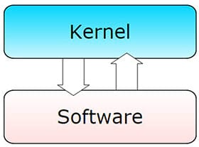
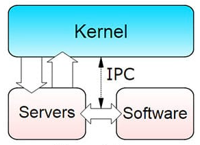
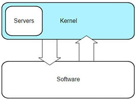
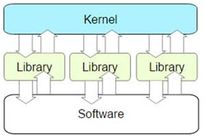

## **¿Qué es el kernel?**
El kernel se encuentra en el centro del sistema operativo y controla todas las funciones importantes del hardware, ya sea un sistema Linux macOS o Windows, un smartphone, un servidor, una virtualización como KVM o cualquier otro tipo de ordenador. Es el núcleo del sistema operativo. Un kernel tampoco es una API ni un framework.

## **Algunas tareas  de un kernel**
- Procesamiento paralelo de diferentes tareas(multitasking).
- Sirve de intermediario para el software del sistema, el software de aplicación y las bibliotecas.
- Se cargan los servicios del sistema, se inician o detienen otros procesos y se inician los programas de usuario como la asignación de espacio de almacenamiento.
- En los sistemas multiusuario, el kernel también controla los derechos de acceso a los archivos y a los componentes de hardware.
 

## **Tipos de Kernel**

|Monolítico |Microkernel |Híbrido |Exonúcleo |
|:---:|:---:|:---:|:---:|
|||| |
||||

### **Monolitico**

### **Microkernel**

### **Híbrido**

### **Exonúcleo**

## **User vs Kernel Mode**

|User |Kernel Mode |
|:---:|:---:|
|||